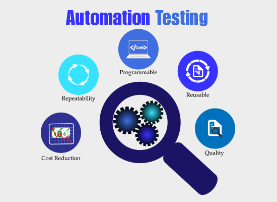
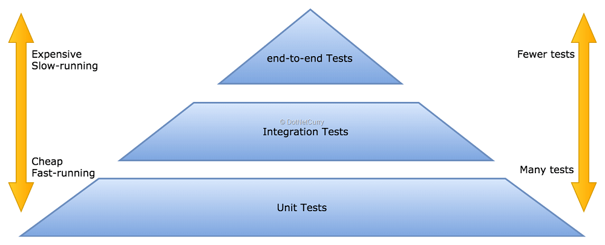
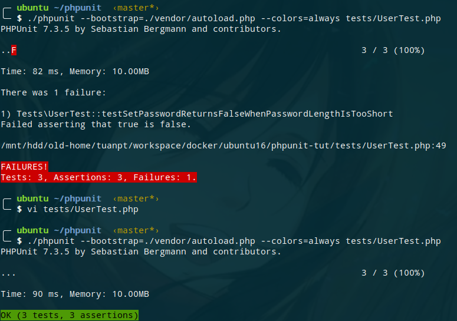
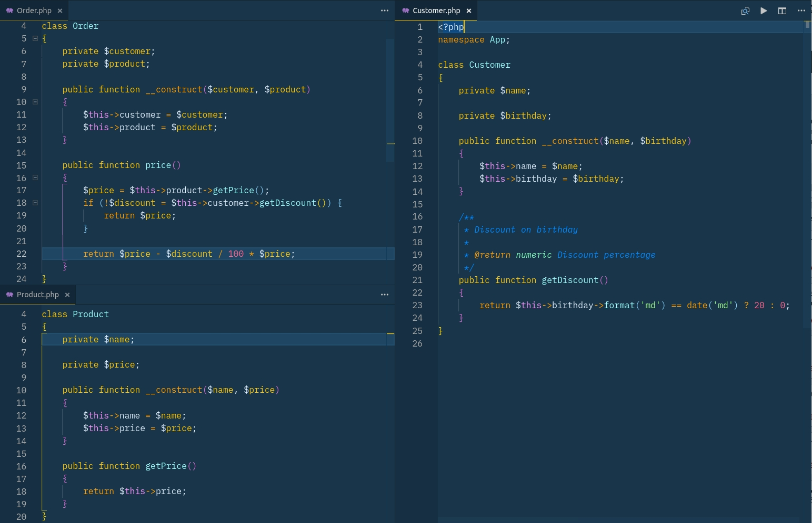

# Automation Tests là gì?
- Kiểm thử tự động
- Viết code để test code (Test case as code)


# Tại sao thực hiện Automation Test? (Lợi ích)
- Cân nhắc kỹ hơn khi viết code (design code)
- Tự tin hơn trong việc tích hợp, bảo trì, mở rộng và refactor hệ thống (Refactor with confidence)
- Tích hợp CI/CD tự động hóa quá trình merge, deploy
- Team work: teammate có thể không biết code của người khác



# Các loại Automation Test? (Test level)
Unit testing, Integration test, Funtional test, Feature test, Acceptance test, End-to-end test, System test...??



Tuy nhiên developer trước tiên chỉ cần focus vào 2 loại test:
## Unit test
+ Test từng function hoặc method của một class
+ Không thực hiện những việc sau:
  * Truy vấn cơ sở dữ liệu (làm chậm quá trình test)
  * Sử dụng network, gọi api bên ngoài (làm chậm, kết quả không ổn định vì phụ thuộc vào mạng)
  * Sử dụng file system (làm chậm quá trình test)


## Integration test:
+ Test việc kết hợp giữa các unit (function, method) với nhau => test một nhóm Unit

  Chẳng hạn Unit test, test từng method của Service và Controller sử dụng service

    * => Integration sẽ test việc sử dụng kết hợp service và controller

    * => Test route
+ Có thể truy vấn cơ sở dữ liệu (thiết lập một database test riêng biệt)
+ Có thể sử dụng file system (test việc import/export file, file permission...)

> Với những ứng dụng nhỏ, số lượng code không quá nhiều, chúng ta có thể chỉ cần thực hiện integration tests mà sử dụng database connection, lợi ích là giảm effort mà vẫn giữ được tốc độ của cả quá trình testing.


# PHPUnit
## Cài đặt
Cài đặt theo từng project:
```sh
composer require --dev phpunit/phpunit
```
Khi đó ta có tool:
```sh
./vendor/bin/phpunit
```

## Cấu hình
File cấu hình `phpunit.xml` (thường đã có sẵn trong project Laravel):
```xml

<?xml version="1.0" encoding="UTF-8"?>
<phpunit bootstrap="vendor/autoload.php"
         colors="true"
         convertErrorsToExceptions="true"
         convertNoticesToExceptions="true"
         convertWarningsToExceptions="true"
         processIsolation="false"
         stopOnFailure="true">
    <testsuites>
        <testsuite name="Integration">
            <directory suffix="Test.php">./tests/Integration</directory>
        </testsuite>
        <testsuite name="Unit">
            <directory suffix="Test.php">./tests/Unit</directory>
        </testsuite>
    </testsuites>
    <filter>
        <!-- For generate coverage report -->
        <whitelist processUncoveredFilesFromWhitelist="true">
            <directory suffix=".php">./app</directory>
        </whitelist>
    </filter>
    <php>
        <!-- Environment variables -->
        <env name="APP_ENV" value="testing"/>
        <env name="APP_KEY" value="App under test"/>
    </php>
</phpunit>
```
Environment variables có thể khai báo trực tiếp trong file `phpunit.xml` hoặc sử dụng file `env.testing` (Laravel):
```ini
APP_NAME="App Test"
APP_KEY=...
APP_DEBUG=false
APP_URL=http://localhost

DB_CONNECTION=mysql
DB_HOST=127.0.0.1
DB_PORT=3306
DB_DATABASE=db_test
DB_USERNAME=db_test
DB_PASSWORD=secret
```
Recommend cách sử dụng file `phpunit.xml` support trực tiếp bởi phpunit, không phụ thuộc vào file env (sử dụng DotEnv).
```sh
phpunit.xml.dist    # Base, example config, commit to git
phpunit.xml.ci      # Base config for ci (for example), commit to git
phpunit.xml         # Ignore by git
```

## Chạy test
Chạy toàn bộ test case theo config như file `phpunit.xml`:
```sh
./vendor/bin/phpunit
```
Chạy từng test suite:
```sh
./vendor/bin/phpunit --testsuite=Unit
./vendor/bin/phpunit --testsuite=Integration
```
Chạy từng file:
```sh
./vendor/bin/phpunit tests/Unit/ProductServiceTest.php
```
Filter test case:
```sh
./vendor/bin/phpunit --filter 'TestNamespace\\TestCaseClass::testMethod'
./vendor/bin/phpunit --filter 'TestNamespace\\TestCaseClass'
./vendor/bin/phpunit --filter TestNamespace
./vendor/bin/phpunit --filter TestCaseClass
./vendor/bin/phpunit --filter testMethod
```
Format output theo từng test case:
```sh
./vendor/bin/phpunit --testdox
```



## Code coverage
- Đánh giá mức độ mà source code đã được thực thi, khi chạy test (Hay độ bao phủ của test case)
- Công thức tính:
  > Code Coverage = (Tổng số dòng Code được gọi bởi các bài Tests của bạn) / (Tổng số dòng Code trong thực tế) x 100%
- Code Coverage có thể được tạo ra bằng PHPUnit với extension with Xdebug được kích hoạt. Bởi vậy, hãy chắc chắn rằng bạn đã cài đặt và bật Xdebug lên:
  ```sh
  ./vendor/bin/phpunit --coverage-html coverage/

  # Or xml output
  ./vendor/bin/phpunit --coverage-clover test-report.xml
  ```
- Hoặc generate report với `phpdbg` (apt package `php-phpdbg`) mà không cần Xdebug:
  ```sh
  phpdbg -qrr ./vendor/bin/phpunit --coverage-html coverage/
  ```
- Tham khảo: https://viblo.asia/p/php-unit-test-401-tao-bao-cao-coverage-reports-va-chi-so-crap-ByEZkWXWZQ0

> 100% code coverage is not our main purpose of test!!! 70 - 80% is ok!
>
> Quotes:
> - Quality over quantity
> - If it scares you then write test for it
> - Think how to write enough test cases
> - Think how to write test correctly
> - Think how to write simple code, simple test
> - Think how to write fast test

## Convention (Laravel)
- Cấu trúc thư mục
  + Tất cả Unit Tests được đặt trong thư mục `tests/Unit` (xem config testsuite trong `phpunit.xml`)
  + Tất cả Integration Tests được đặt trong thư mục `tests/Integration`
  + Nội dung bên trong thư mục `Unit` có cấu trúc giống với cấu trúc bên trong thư mục `app`. Ví dụ như Unit Test cho file `app/Models/User.php` tương ứng là `tests/Unit/Models/UserTest.php`
- Quy tắc đặt tên
  + Thường có namespace bắt đầu với `Tests\` (xem phần `autoload-dev` trong composer.json)
  + Method test phải được bắt đầu bằng `test`, viết dạng `camelCase` hay `snake_case` đều được, không phải quá lo lắng về tên method test quá dài, nhưng nên chọn 1 trong hai cho thống nhất, prefer `snake_case` để cho dễ đọc hơn:
   ```php
   public function test_it_throws_an_exception_when_email_is_too_long()
   {
   }
   ```

## Example test
```php
<?php
// tests/Unit/CalculatorTest.php
namespace Tests\Unit;

use PHPUnit\Framework\TestCase; // PHPUnit_Framework_TestCase (old version)
use App\Calculator;

class CalculatorTest extends TestCase
{
    public function test_add_return_correct_value()
    {
        // Given (these numbers)
        // Arrange input
        $numbers = [1, 2];

        // When (add them)
        // Act: call unit
        $calculator = new Calculator; // Class Under Test
        $actualResult = $calculator->add($numbers); // Method Under Test

        // Then (verify the result is correct)
        // Assert
        $expectedResult = 3;
        $this->assertEquals($expectedResult, $actualResult);
    }
}
```
Thường được chia thành 3 phần theo các pattern:
- Given - When - Then
- Arrange - Act - Assert

PHPUnit TestCase cung cấp một số method hỗ trợ cho việc chuẩn bị (arrange) input:
- `setUp()`: Chạy trước mỗi method test
- `tearDown()`: Chạy sau mỗi method test
- `setUpBeforeClass()`: Chạy khi bắt đầu class test
- `tearDownAfterClass()`: Chạy sau khi kết thúc class test

Ví dụ:
```php
class ExampleTest extends TestCase
{
    protected static $db;

    protected $classUnderTest;

    public static function setUpBeforeClass()
    {
        self::$db = new PDO('sqlite::memory:');
    }

    public function setUp()
    {
        parent::setUp();
        $this->classUnderTest = new MyClass;
        // Database begin transaction
        self::$db->beginTransaction();
    }

    public function test_add_return_correct_value()
    {
    }

    public function test_add_throws_exception_if_input_is_nan()
    {
    }

    public function tearDown()
    {
        // Rollback transaction for fresh database state
        self::$db->rollback();
    }

    public static function tearDownAfterClass()
    {
        self::$db = null;
    }
}
```
Trình tự PHPUnit thực hiện test:
1. `ExampleTest::setUpBeforeClass()`
---
2. `ExampleTest::setUp()`
3. `ExampleTest::test_add_return_correct_value()`
4. `ExampleTest::tearDown()`
---
5. `ExampleTest::setUp()`
6. `ExampleTest::test_add_throws_exception_if_input_is_nan()`
7. `ExampleTest::tearDown()`
---
8. `ExampleTest::tearDownAfterClass()`

Ví dụ khi test database trong Laravel:
```php
use Tests\TestCase;
use Illuminate\Foundation\Testing\DatabaseTransactions;

class ExampleTest extends TestCase
{
    use DatabaseTransactions;

    protected $classUnderTest;

    public function setUp()
    {
        parent::setUp();
        $this->classUnderTest = new MyClass;
    }

    public function test_add_return_correct_value()
    {
    }

    public function test_add_throws_exception_if_input_is_nan()
    {
    }
}
```
Khi use trait `DatabaseTransactions` Laravel tự động setup tạo transaction cho mỗi test case, đảm bảo các test case sử dụng một trạng thái database riêng biệt và không phụ thuộc vào nhau.
Có thể tham khảo cách Laravel thực hiện ở đây:
- https://github.com/laravel/framework/blob/5.8/src/Illuminate/Foundation/Testing/DatabaseTransactions.php
- https://github.com/laravel/framework/blob/5.8/src/Illuminate/Foundation/Testing/TestCase.php#L72
- https://github.com/laravel/framework/blob/5.8/src/Illuminate/Foundation/Testing/TestCase.php#L100

## Assertion
```php
**
 * Verify $actualValue equals to $expectedValue?
 * Nếu không đúng, thì show ra message
 * Nếu không truyền vào message thì PHPUnit sẽ tự động generate:
 * => Failed asserting that 4 matches expected 5.
 */
function assertEquals($expectedValue, $actualValue, $message = '')
```

Một số assertion thường dùng:
- `assertTrue()` <> `assertFalse()`
- `assertEquals()` <> `assertNotEquals()`: So sánh bằng
- `assertSame()` <> `assertNotSame()`: So sánh bằng, cùng kiểu
- `assertContains()` <> `assertNotContains()`: Array contain, String contains
- `assertArrayHasKey()` <> `assertArrayNotHasKey()`
- `assertInstanceOf()` <> `assertNotInstanceOf()`: Đối tượng thuộc class
- `assertCount()`
- `expectException()`: Expect sẽ có Exception khi gọi chạy unit, chú ý phải gọi trước khi gọi method / function
  ```php
  public function test_foo()
  {
      $this->expectException(InvalidArgument::class);
      $this->classUnderTest->execute();
  }
  ```

Best practice:
- Sử dụng assertion phù hợp
  + => Code dễ đọc hiểu hơn
  + => Nếu assert failed thì message sinh ra cũng dễ hiểu hơn
- Signature của các method assert thường có các tham số theo thứ tự là expected value (giá trị mong muốn), actual value (giá trị thực tế khi chạy unit), message (message thông báo nếu fail)
  + => Truyền theo thứ tự để PHPUnit có thể generate ra message báo lỗi chính xác.

```php
$this->assertEquals($expected, $actual);
// => Failed asserting that $actual matches expected $expected.
$this->assertTrue($expected == $actual);
// => Failed asserting that false is true??

$this->assertSame($expected, $actual);
$this->assertTrue($expected === $actual);

$this->assertContains($element, $array);
$this->assertTrue(in_array($element, $array);

$this->assertCount($expected, $actual);
$this->assertTrue(count($actual) == $expected);

$this->assertInstanceOf(ExpectedClass::class, $actual);
$this->assertTrue($actual instanceOf ExpectedClass);
```

## Data provider
Sử dụng `@dataProvider` cho những trường hợp chỉ khác nhau input, output

```php
/**
 * @dataProvider provider_test_foo
 */
public function test_foo($variableOne, $variableTwo)
{
    $this->assertEquals($variableOne, $this->classUnderTest->execute($variableTwo));
}

public function provider_test_foo()
{
    return [
        ['test 1, variable one', 'test 1, variable two'],
        ['test 2, variable one', 'test 2, variable two'],
        ['test 3, variable one', 'test 3, variable two'],
    ];
}
```
Ví dụ:
```php
// Laravel model mutator
public function setIsVerifiedAttribute($value)
{
    $this->attributes['was_verified'] = $value === true || $value === 'true';
}

// Test
/**
 * @dataProvider provider_test_get_was_verified_return_correct
 */
public function test_get_was_verified_return_correct($fromValue, $expectedValue)
{
    $model = (new Model)->setIsVerifiedAttribute($fromValue);
    $this->assertSame($expectedValue, $model->was_verified);
}

public function provider_test_get_was_verified_return_correct()
{
    return [
        ['true', true],
        [true, true],
        ['false', false],
        [false, false],
        [0, false],
        [1,  false],
        ['test string', false],
        ['', false],
    ];
}
```

# Test case
> Quote from: https://github.com/framgia/laravel-test-guideline/blob/master/vn/Knowledge.md

Trước khi tạo bất cứ Test Cases nào, chúng ta nên xác định rõ giá trị đầu vào của **từng function/method** cần được test.

Các Test Cases phải được thiết kế để có thể cover được hết các sự kết hợp của các giá trị inputs cùng các điều kiện, bao phủ hết các nhánh if/else.

Nhìn chung, chúng ta thường chia test case ra làm 3 loại dựa trên dữ liệu inputs cho Unit Test.

- **Normal**: Inputs thuộc vào dải dữ liệu bình thường (accepted). Một lượng lớn codes có thể được cover bằng cách chỉ cần chạy **normal** test cases.
- **Boundary**: Inputs bằng hoặc xấp xỉ giá trị maximum hay minimum. Chúng được sử dụng để phát hiện lỗi tại cận, thay vì tìm kiếm lỗi tại những vị trí ở giữa trong dải input.
- **Abnormal**: Inputs là không hợp lệ hay không được kỳ vọng, dùng để kiểm tra khả năng handle lỗi.

Ví dụ: *Giả sử như chúng ta có một function để kiểm tra địa chỉ email nhập vào từ user. Độ dài tối đa của email là 50 ký tự.*

```php
function validate($email) {
    if (filter_var($email, FILTER_VALIDATE_EMAIL) && strlen($email) <= 50) {
        return true;
    }
    return false;
}

```

Chúng ta nên viết các Test Cases như sau:

<details>
    <summary>Normal cases</summary>

```php
public function test_valid_email_format_and_length()
{
    // Email with length 18 (less than: maximum - 1)
    $email = 'sample@framgia.com';
    $this->assertEquals(true, validate($email));
}
```

</details>

<details>
    <summary>Boundary cases</summary>

```php
public function test_valid_email_format_and_length_max_minus()
{
    // Email with length 49 (maximum - 1)
    $email = 'samplesamplesamplesamplesamplesamples@framgia.com';
    $this->assertEquals(true, validate($email));
}

public function test_valid_email_format_and_length_max()
{
    // Email with length 50 (equal maximum)
    $email = 'samplesamplesamplesamplesamplesamplesa@framgia.com';
    $this->assertEquals(true, validate($email));
}

public function test_valid_email_format_and_length_max_plus()
{
    // Email with length 51 (maximum + 1)
    $email = 'samplesamplesamplesamplesamplesamplesam@framgia.com';
    $this->assertEquals(false, validate($email));
}
```

</details>

<details>
    <summary>Abnormal cases</summary>

```php
public function test_invalid_email_format()
{
    // Invalid email format with normal length (between 0 ~ 50)
    $email = 'framgia.com';
    $this->assertEquals(false, validate($email));
}

public function test_valid_email_format_and_length_exceeded()
{
    // Email with length 54
    $email = 'samplesamplesamplesamplesamplesamplesample@framgia.com';
    $this->assertEquals(false, validate($email));
}
```

</details>

# Test cô lập (test doubles)
Nguyên tắc cơ bản của Unit Test: test cô lập.
- Giả lập access API / web service ngoài (mạng)
- Giả lập access database?
- Giả lập lời gọi hàm từ các class khác?

Giả lập là gì?
- Giả lập = thay thế các object sử dụng cho production với 1 một object giúp cho việc testing
- Giả lập = thay thế real object với mock object
- Mock object bắt chước hành vi của real object, nhưng chúng ta có thể tự định nghĩa kết quả trả về theo từng kịch bản test case

Có hai quan điểm về unit test cô lập:
- **Sociable test**: Chỉ giả lập (mock) các dependencies gây chậm hoặc có side effects lớn hoặc không thể dùng trong test environment: database, network call...
- **Solitary test**: Giả lập tất cả dependencies


> *[https://martinfowler.com/bliki/UnitTest.html](https://martinfowler.com/bliki/UnitTest.html)*

Ví dụ:
Có 3 class `Order`, `Customer`, `Product`, với yêu cầu khi user order 1 sản phẩm, nếu ngày order trùng với ngày sinh của user thì user sẽ được giảm 20%.



Class `Order` có 2 dependencies là `Product` và `Customer`, cần viết test cho method `Order::price()`:
- **Sociable Test**: do `Product::getPrice()` và `Customer::getDiscount()` đều không có logic phức tạp hay có khả năng làm chậm test nên sẽ không thực hiện giả lập
```php
namespace Tests\Unit;

use PHPUnit\Framework\TestCase;
use App\Customer;
use App\Product;
use App\Order;
use DateTimeImmutable;

class SociableOrderTest extends TestCase
{
    public function test_price_return_correct_value()
    {
        $product = new Product('PS4', 100);
        $customer = new Customer('Hunter', new DateTimeImmutable(date('Y/m/d')));
        $order = new Order($customer, $product);

        $this->assertEquals(80, $order->price());
    }
}
```
- **Solitary Test**:
```php
class SolitaryOrderTest extends TestCase
{
    public function test_price_return_correct_value()
    {
        // Giả lập (mock) Product
        $product = $this->createMock(Product::class);
        // Expect $product->getPrice() được gọi 1 lần và trả về 100
        $product->expects($this->once())
            ->method('getPrice')
            ->willReturn(100);

        // Giả lập (mock) Customer
        $customer = $this->createMock(Customer::class);
        // Expect $customer->getDiscount() được gọi 1 lần và trả về 20
        $customer->expects($this->once())
            ->method('getDiscount')
            ->willReturn(20);

        $order = new Order($customer, $product);

        $this->assertEquals(80, $order->price());
    }
}
```
Vì đã được giả lập nên khi logic của `Product::getPrice()` và `Customer::getDiscount()` thay đổi thì `SolitaryOrderTest` không cần phải update lại.

Vậy khi nào cần giả lập (mock), chúng ta có thể áp dụng cả 2 quan điểm:
- Nếu code được cấu trúc tốt thì thường có 2 loại class:
+ Model: nhiệm vụ chính là để lưu dữ liệu bên trong và không thực hiện nhiều logic bên trong => không cần mock, chỉ đơn giản là khởi tạo đối tượng và truyền vào fake data cho nó
+ Service: nhiệm vụ chính là thực hiện công việc, logic => mock
```php
class OrderTest extends TestCase
{
    public function test_price_return_correct_value()
    {
        $product = new Product('PS4', 100);

        // Giả lập (mock) Customer
        $customer = $this->createMock(Customer::class);
        // Expect $customer->getDiscount() được gọi 1 lần và trả về 20
        $customer->expects($this->once())
            ->method('getDiscount')
            ->willReturn(20);

        $order = new Order($customer, $product);

        $this->assertEquals(80, $order->price());
    }
}
```
- Khi việc mock quá phức tạp hãy thực hiện refactor code hoặc thực hiện integration test

# Dependency Injection
- Method `Order::price()` cần sử dụng `Product::getPrice()` và `Customer::getDiscount()` nên class `Order` có 2 dependencies là `Product` và `Customer`
- Muốn giả lập thì các dependencies phải được khai báo tường minh (explicit dependencies), tức là được truyền vào constructor, class không có nhiệm vụ khởi tạo dependencies
- Nếu khởi tạo bằng `new` hoặc dùng static method bên trong thì không có cách nào để giả lập (thực ra thì cũng có nhưng thường dùng trick về autoloading của PHP chứ PHP không hỗ trợ kỹ thuật Monkey Patching (*))
```php
// Bad method
public function register(array $inputs)
{
    // ...
    (new MailService())->send($user);
    // …
    MailService::send($user);
}
```
```php
// Good, using dependency injection
public function __construct(MailService $mailService)
{
    $this->mailService = $mailService;
}

public function register(array $inputs)
{
    $transaction = $this->mailService->send($user);
}
```

# Mock vs Stub
Có nhiều loại test doubles, nhưng chỉ cần focus vào 2 loại chính

## Stub
Giả lập trạng thái => loại bỏ tất cả logic bên trong method của object thật và có thể thay đổi kết quả trả về của method theo ý muốn
```php
// Create mock object
$product = $this->createMock(Product::class);
// Stub method price, make it return 100
$product->method('getPrice')->will($this->returnValue(100));
```

## Mock
Verify hành vi => khi method under test được gọi thì chúng ta **expect** mock method cũng được gọi, 1 lần hoặc 2 lần hoặc nhiều lần, được truyền tham số gì...
```php
public function test_order_sends_mail_if_succeeded()
{
    $mailService = $this->createMock(MailService::class);
    $order = new Order('Wine', 'user@localhost', $mailService);

    // Expect method MailService::send được gọi duy nhất 1 lần,
    // với 2 tham số là 'user@localhost' và 'Order succeeded!'
    // Expect cần được viết trước khi gọi method test
    $mailService->expects(once())
        ->method('send');
        ->with(
            $this->equalTo('user@localhost'),
            $this->equalTo('Order succeeded!')
        );

    $result = $order->process();

    $this->assertTrue($result);
}
```

# Integration test

Ví dụ trong Laravel
- Đăng nhập bằng một user
- Gửi POST request đến URL `/api/news` với payload `{"title": "Hot fake news!", "content": "Lorem Ipsum..."}`
- Response trả về thành công (HTTP code 200)
- Thêm mới bản ghi vào bảng news
- Gửi mail newsletter cho những user đăng ký

```php
namespace Tests\Integration;

use Tests\TestCase;
use App\Models\User;
use App\Jobs\SendNewsletter;
use Illuminate\Foundation\Testing\DatabaseTransactions;

class NewsApiTest extends TestCase
{
    use DatabaseTransactions;

    protected $user;

    public function setUp()
    {
        parent::setUp();

        $this->user = factory(User::class)->create();
    }

    public function test_an_user_can_create_new_servers()
    {
        $data = [
            'title' => 'Hot fake news!',
            'content' => 'Lorem Ipsum...',
        ];

        $this->expectsJobs(SendNewsletter::class);

        $this->actingAs($this->user, 'api')
            ->postJson('/api/news', $data)
            ->assertStatus(200);

        $this->assertDatabaseHas('news', [
            'user_id' => $this->user->id,
            'title' => $data['title'],
            'content' => $data['content'],
        ]);
    }
}
```

Có thể sử dụng SQLite in-memory database khi thực hiện integration test thay vì MySQL để cải thiện hiệu năng và tăng tốc quá trình test. Tuy nhiên có một chú ý là database migration hay database seed phải được chạy trong quá trình test chứ không thể chạy trước khi chạy test. Khi đó chúng ta sử dụng trait `RefreshDatabase` để vừa refresh database sau mỗi test case. Còn khi sử dụng database test là MySQL thì thực hiện migration trước khi và sử dụng `DatabaseTransactions` thay vì phải chạy lại migration trong mỗi test case.

Có thể tạo 1 trait chung cho test DB:
```php
trait SetupDatabaseTrait
{
    use RefreshDatabase; // For SQLite in memory
    // use DatabaseTransactions; // For other DB connections
}

class NewsApiTest extends TestCase
{
    use SetupDatabaseTrait;
}
```
Khi muốn chuyển đổi database test giữa MySQL và SQLite thì chỉ cần sửa lại trong trait `SetupDatabaseTrait`.

# Cần test những gì?
## Model:
### Test accessors and mutators
VD:
```php
class User extends Model
{
    public function setPasswordAttribute($password)
    {
        $this->attributes['password'] = Hash::make($password);
    }
}

class UserTest extends TestCase
{
    public function testHashesPasswordWhenSet()
    {
        Hash::shouldReceive('make')->once()->andReturn('hashed');

        $author = new User;
        $author->password = 'foo';

        $this->assertEquals('hashed', $author->password);
    }
}
```

Ở đây method `Hash::make()` được mock, có thể hiểu như sau: Tôi mong muốn `make()` method của class `Hash` được gọi 1 lần và khi được gọi nó trả về giá trị stub là `hashed` nhằm mục đích để biết chính xác kết quả trả về và assert với kết quả thực tế của method `setPasswordAttribute`.

### Test scopes
```php
class User extends Model
{
    public function scopeOldest($query)
    {
        return $query->orderBy('age', 'desc');
    }
}
```
Mr. JeffreyWay có đưa ra một [thảo luận](https://gist.github.com/JeffreyWay/5674014), và đưa ra một vài khả năng:
1. Không cần test method này?
2. Thực hiện integration test với test database, bằng cách insert một vài record vào db, gọi method và assert method trả về correct row.
3. Partial mock class User và verify method `orderBy` được gọi.

Hầu hết các ý đều đồng tình với cách thứ 2, vì:
- Chỉ đơn giản chúng ta đang sử dụng các unit của Eloquent/QueryBuilder mà không có logic gì phức tạp
- Eloquent và QueryBuilder đều đã được test ở mức độ unit test để kiểm chứng tính đúng đắn khi chạy độc lập
- Nếu thực mock, chúng ta sẽ expect method `orderBy` được gọi với 2 tham số `age` và `desc` nhưng làm sao để biết `age` có đúng là 1 trường trong database?

Vì thế, integration test là cách hợp lý nhất ở đây:
```php
class UserTest extends TestCase
{
    public function testGetsOldestUser()
    {
        // Arrange: Insert two test rows into a test DB
        Factory::create('User', ['age' => 20]);
        Factory::create('User', ['age' => 30]);

        // Act: call the method
        $oldest = User::oldest()->first();

        // Assert
        $this->assertEquals(30, $oldest->age);
    }
}
```

### Test relationships
Thực hiện assert kết quả của các relation thuộc class tương ứng:
- `HasMany`
- `BelongsTo`
- `BelongsToMany`
- ...

### Test custom methods
VD1:
```php
class User extends Model
{
    public function fullname()
    {
        return $this->firstname . ' - ' . $this->lastname;
    }
}

class UserTest extends TestCase
{
    public function testGetFullName()
    {
        $user = new User;
        $user->firstname = 'Edogawa';
        $user->lastname = 'Conan';

        $this->assertEquals('Edogawa Conan', $user->fullname());
    }
}
```
### Integration test cho việc thiết lập `fillable`, `hidden`, `casts`
- Unit test đã được framework thực hiện
- Tương tự khi test scope, chúng ta thực hiện integration test để đảm bảo các field được mapping chính xác với DB schema

## Form request:
- Không thực hiện unit test nếu form request chỉ khai báo `rules()` và không có logic gì đặc biệt? Vì việc test các rule validation đã được Laravel thực hiện trong core framework, chúng ta chỉ khai báo sử dụng nó!
- Một cách khác để thực hiện unit test đó là tự validate FormRequest thông qua `Validator::make()`, tuy nhiên nên nhớ là FormRequest có thể override lại method `getValidatorInstance()` để thực hiện một số logic khác. VD chi tiết tại đây: https://gist.github.com/tuanpht/37394e0df10d48d08d0d406c9a7dd477
- Thay vào đó chúng ta thực hiện integration test khi test controller, vì mục đích của class form request thường chỉ để tách phần khai báo rule ra khỏi controller, nên cần test tích hợp để nó có hoạt động như mong muốn khi kết hợp với controller hay không, response khi validate failed là gì...

## Controller
Nhắc lại về nhiệm vụ của Controller:
- Điều hướng HTTP request
- Gọi đến domain object để thực hiện logic và lấy kết quả trả về (Fat Model - Skinny Controller)

Ngoài ra các action như thêm/sửa thường sử dụng thêm FormRequest.

Với cách làm trên, ta có thể viết test như sau:

### Unit test
Do unit test không sử dụng database test nên nếu bạn sử dụng trực tiếp Eloquent Model trong controller thì sẽ khó thực hiện unit test. Nên cân nhắc tách ra 1 tầng trung gian (repository, service)

- Test trả về đúng view, data
```php
class ProductController extends Controller
{
    private $productService;

    public function __construct(ProductService $productService)
    {
        //
    }

    public function index(Request $request)
    {
        return view('product.index')->with(
            'products',
            $this->productService->list($request->all())
        );
    }
}

class ProductControllerTest extends TestCase
{
    public function testIndexReturnView()
    {
        $productService = Mockery::mock(ProductService::class);
        $controller = new ProductController($productService);
        $request = Request::create('');

        $view = $controller->index($request);

        $this->assertEquals('product.index', $view->name());
        $this->assertArrayHasKeys('products', $view->getData());
    }
}
```
- Test redirection
```php
public function testRedirectAfterCreatedSuccess()
{
    $this->assertInstanceOf(RedirectResponse::class, $response);
    $this->assertEquals(route('product.index'), $response->headers->get('Location'));
}

public function testRedirectAfterCreatedFailed()
{
    $this->assertInstanceOf(RedirectResponse::class, $response);
    $this->assertEquals(route('product.create'), $response->headers->get('Location'));
}
```

### Integration test
- Do ta đã tách logic DB sử dụng repository (service) nên integration test controller có thể mock repository và thực hiện test repository integrate với DB riêng biệt
- Thực hiện test tích hợp với FormRequest, tạo ra các input mẫu và test các trường hợp input đúng, input sai, assert response tương ứng với từng trường hợp
- Test authentication

# Tham khảo
- [Framgia's Laravel Testing Guidelines](https://github.com/framgia/laravel-test-guideline/)
- [JeffreyWay - Laravel Testing Decoded](https://leanpub.com/laravel-testing-decoded)
- [Martin Fowler - Unit Test](https://martinfowler.com/bliki/UnitTest.html)
- Viblo's [Automation Testing ASP.NET Core 2.0](https://viblo.asia/p/ByEZk96E5Q0)
- Viblo's [Tản mạn về Testing](https://viblo.asia/p/1Je5EMn05nL)
- [Ham Vocke - The Practical Test Pyramid](https://martinfowler.com/articles/practical-test-pyramid.html)
- Viblo's [PHP Unit Testing With PHPUnit](https://viblo.asia/s/php-unit-testing-with-phpunit-Wj53OmBb56m)
- [PHPUnit Manual](https://phpunit.de/manual/current/en/phpunit-book.pdf)
- [Laravel Testing Official Documents](https://laravel.com/docs/master/testing)
- [Laravel Testing Decoded](https://leanpub.com/laravel-testing-decoded)
- Laracast's [Testing Jargon](https://laracasts.com/series/testing-jargon)
- Laracast's [Testing Laravel](https://laracasts.com/series/phpunit-testing-in-laravel)
- Laracast's [Intuitive Integration Testing](https://laracasts.com/series/intuitive-integration-testing)
- https://github.com/comradssolutions/Test-Driven-Laravel
- https://blog.jgrossi.com/2018/solitary-or-sociable-testing-events-and-listeners-using-laravel/
- https://symfonycasts.com/screencast/phpunit/

# Các kỹ thuật khác
(*)
- https://github.com/Codeception/AspectMock
- https://github.com/kahlan/kahlan
- https://github.com/infection/infection
- https://www.phpspec.net/en/stable/
